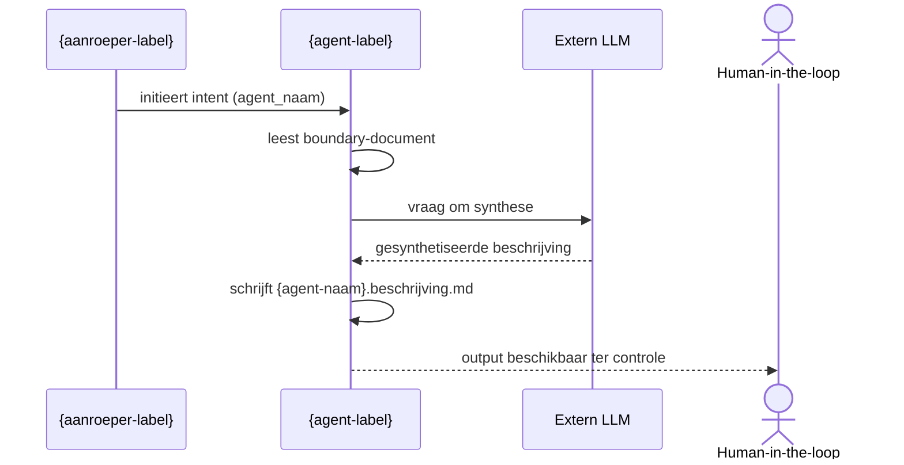

# Ecosysteem-beschrijver — Beschrijf Agent Positionering

## Rolbeschrijving (korte samenvatting)

De ecosysteem-beschrijver legt de positionering van een agent vast als context diagram: wie roept de agent aan, welke externe services of agents roept de agent zelf aan — feitelijk en volledig herleidbaar tot het boundary-document.

**VERPLICHT**: Raadpleeg de agent charter voor volledige context, grenzen en werkwijze.  
**Conventie**: Charter bevindt zich in `ecosysteem-beschrijver.charter.md` in de parent folder van dit contract.

## Contract

### Input (wat gaat erin)

**Verplichte parameters**:
- `agent_naam`: Naam van de agent waarvan de positionering wordt beschreven (type: string, kebab-case).

**Optionele parameters**:
- `boundary_file`: Pad naar het boundary-document van de agent (type: string, default: afgeleid uit `agent_naam` en `value_stream_fase`).
- `scope`: Breedte van het overzicht; "één agent" of "alle agents in fase" (type: string, default: "één agent").

**Afgeleide informatie** (geëxtraheerd uit boundary):
- `aanroepers`: Wie de agent aanroept (uit "Toelichting" of "Mogelijke raakvlakken" sectie).
- `externe_diensten`: Wat de agent aanroept (LLM, andere agents, tools).

### Output (wat komt eruit)

De ecosysteem-beschrijver levert:
- **Positioneringsdocument** (.md) met een Mermaid `flowchart LR` context diagram per agent.

**Deliverable bestand**: `artefacten/{vs}/{vs}.{fase}.{agent_naam}/{agent_naam}.beschrijving.md`

**Outputformaat**:

Het outputdocument bevat de volgende verplichte secties:

```markdown
---
agent: ecosysteem-beschrijver
intent: beschrijf-agent-positionering
value_stream_fase: {value_stream_fase}
scope: {agent-naam}
timestamp: {yyyy-mm-dd HH:MM}
---

# Positionering: {agent-naam}

## Contextdiagram

```mermaid
flowchart LR
    {aanroeper} -->|{relatie-label}| {agent-naam}
    {agent-naam} -->|{relatie-label}| {externe-dienst}
    human["👤 Human-in-the-loop"]
    {agent-naam} -->|levert output ter controle| human

    classDef agent-zelf fill:#1565c0,stroke:#0d47a1,color:#bbdefb;
    classDef aanroeper  fill:#bbdefb,stroke:#1e88e5,color:#0d47a1;
    classDef ontvanger  fill:#e8f5e9,stroke:#43a047,color:#1b5e20;
    classDef dienst     fill:#fff8e1,stroke:#f9a825,color:#5d4037;

    class {agent-naam} agent-zelf;
    class {aanroeper} aanroeper;
    class {ontvanger},human ontvanger;
    class {llm},{tools} dienst;
```

## Uitvoeringsdiagram



## Classificatie

| As | Waarde |
|----|--------|
| Vormingsfase | {classificatie-vormingsfase} |
| Betekeniseffect | {classificatie-betekeniseffect} |
| Werking | {classificatie-werking} |
| Bronhouding | {classificatie-bronhouding} |

## Intents en output

| Intent | Output bestand |
|--------|---------------|
| `beschrijf-agent-positionering` | `artefacten/{vs}/{vs}.{fase}.{agent_naam}/{agent_naam}.beschrijving.md` |
| `{overige-intent}` | `artefacten/{vs}/{vs}.{fase}.{agent_naam}/ecosysteem-beschrijver.{overige-intent}.md` |

## Bronbestanden

- `artefacten/{vs}/{vs}.{fase}.{agent-naam}/{agent-naam}.agent-boundary.md`
- `artefacten/{vs}/{vs}.{fase}.{agent-naam}/{agent-naam}.charter.md`
- `artefacten/{vs}/{vs}.{fase}.{agent-naam}/agent-contracten/{agent-naam}.{intent}.agent.md` (één per intent)
```

**Formaat-normering**:
- Default formaat: **Markdown** (.md)
- Twee Mermaid-diagrammen per beschrijving: contextdiagram (`flowchart LR`) + uitvoeringsdiagram (`sequenceDiagram`)
- `classDef` met rolgebaseerde namen (`input`, `output`, `core`, `external`) is verboden — decoratieve styling zonder semantische groepering is toegestaan

### Afleidingslogica (bronnen voor beschrijving)

De agent leidt de inhoud van de beschrijving af uit de volgende bronnen:

| Output-element | Bron |
|----------------|------|
| Directe aanroepers (contextdiagram) | `{agent-naam}.agent-boundary.md` — sectie "Mogelijke raakvlakken" |
| Ondersteunende diensten (contextdiagram) | `{agent-naam}.agent-boundary.md` — sectie "Wat doet de agent concreet?" — LLM, tools |
| `human-in-the-loop` | Vaste actor, altijd aanwezig als reviewer van de output |
| Stappen uitvoeringsdiagram | `{agent-naam}.agent-boundary.md` — secties "Welke inputs verwacht de agent?" en "Welke outputs levert de agent?" |
| Classificatie-waarden | `{agent-naam}.charter.md` — sectie "Mandarin-agent-classificatie" (authoritative) |
| Intents | `agent-contracten/` — aanwezige `.agent.md` bestanden per intent |
| Functionele beschrijving | `{agent-naam}.charter.md` — secties 1–4 (kerntaak, principes, werkwijze, grenzen) |
| Ondersteunende diensten (contextdiagram) | Sectie "Wat doet de agent concreet?" — LLM, tools |
| `human-in-the-loop` | Vaste actor, altijd aanwezig als reviewer van de output |
| Stappen uitvoeringsdiagram | Secties "Welke inputs verwacht de agent?" en "Welke outputs levert de agent?" |
| Classificatie-waarden | Sectie "Mandarin-agent-classificatie (4 orthogonale assen)" |
| Intents | Sectie "Voorstellen agent contracten" |

**Niet opnemen in contextdiagram**:
- `workspace` — intern werkdomein van de agent, geen externe actor
- `mens` — triggert de laag daarboven (coördinator); één laag diep betekent uitsluitend directe aanroepers
- runners en scripts — infrastructuur, geen functionele aanroeper
- ecosysteem-coördinator als `genereer-instructies` — infrastructurele instructie-assemblage, geen inhoudelijke aanroep

**Aanroeper-type bepalen**:
- Agent als aanroeper: gebruik `🤖 {Agent-naam}`
- Mens als aanroeper (exploratieve agents, sfw value stream): gebruik de rolnaam uit boundary sectie "Mogelijke raakvlakken", of `👤 Initiator` als geen expliciete rolnaam is gedefinieerd

### Foutafhandeling

De ecosysteem-beschrijver:
- stopt wanneer `boundary_file` niet bestaat of niet leesbaar is;
- stopt wanneer `agent_naam` geen overeenkomend boundary-document heeft in de workspace;
- stopt wanneer het boundary-document geen informatie bevat over aanroepers of externe diensten;
- escaleert naar agent-curator wanneer raakvlakken onduidelijk of tegenstrijdig zijn in het boundary-document;
- STOP: produceert geen diagram als de positie van de agent niet feitelijk kan worden vastgesteld.

**Contract is extern observeerbaar**: bevat GEEN ontwerp of normering, alleen vastlegging van wat het boundary-document beschrijft.

---

## Governance

**Doctrine-naleving:**
- **doctrine-agent-charter-normering.md** (v2.1.0, AEO.DOC.001):
  - Principe 1 (Identiteit vóór Implementatie): Contract is extern observeerbaar, geen implementatie
  - Principe 2 (Eenduidige Verantwoordelijkheid): Eén intent, één diagram per agent
  - Principe 7 (Transparante Verantwoording): Bronbestanden expliciet vermeld in output
  - Principe 9 (Output-formaat Normering): Markdown als default

**Canon-consultatie:**
- Niet van toepassing — ecosysteem-beschrijver is input-gebonden, geen canon-consultatie vereist

**Transparantie-verplichtingen:**

Bij uitvoering logt de agent:
- ✓ Gelezen bestanden: boundary_file van de agent in scope
- ✓ Aangemaakte bestanden: `{agent_naam}.beschrijving.md`
- ✓ Geen gewijzigde bestanden (output is nieuw of vervangen)

**Escalatie-paden:**
- → agent-curator: voor validatie van positionering als raakvlakken onduidelijk zijn
- → capability-architect: als boundary-document onvoldoende positioneringsinformatie bevat
- STOP: bij ontbrekend of onleesbaar boundary-document

---

## Metadata

**Intent-ID**: `aeo.02.ecosysteem-beschrijver.beschrijf-agent-positionering`  
**Versie**: 1.0.0  
**Value Stream**: Agent Ecosysteem Ontwikkeling (aeo)  
**Fase**: 02 — Ecosysteeminrichting  
**Classificatie**:
- Vormingsfase: Verantwoording
- Betekeniseffect: Beschrijvend
- Werking: Inhoudelijk
- Bronhouding: Input-gebonden
