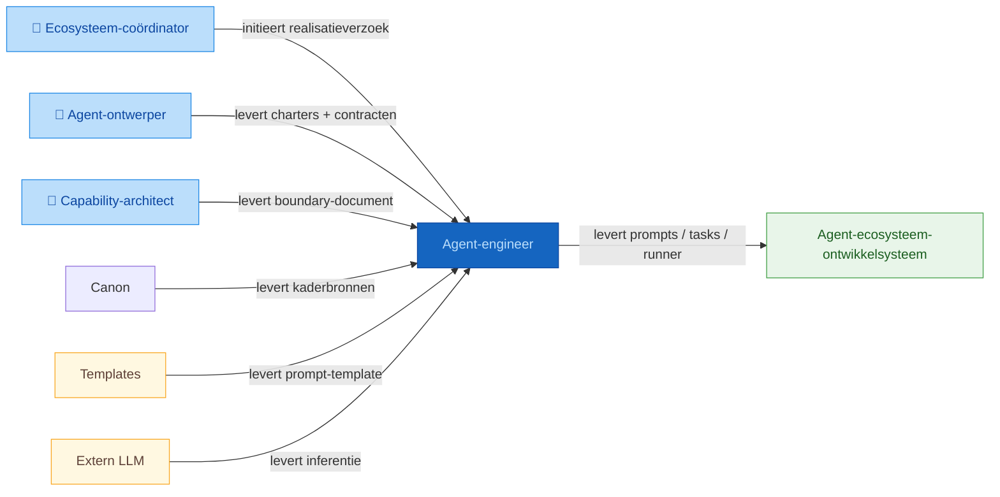
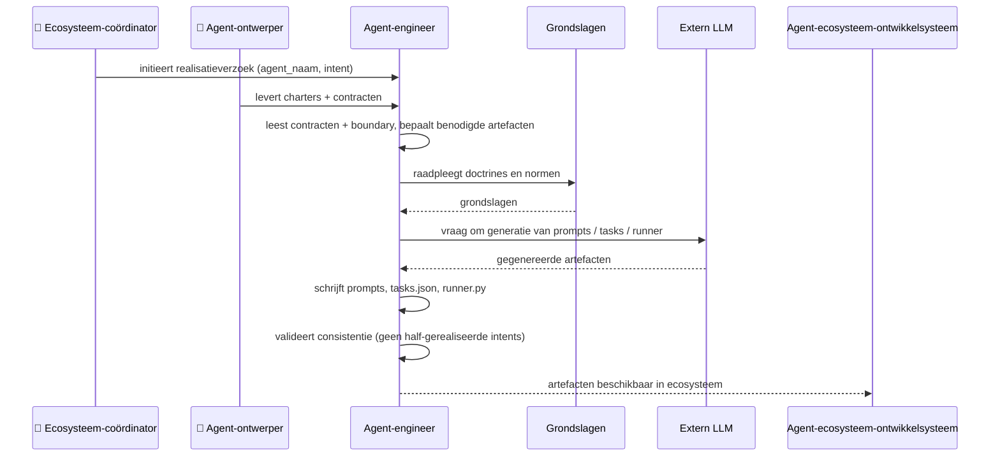

# Positionering: agent-engineer

## Contextdiagram

## Uitvoeringsdiagram

## Classificatie

| As | Waarde |
|----|--------|
| Vormingsfase | Realisatie |
| Betekeniseffect | Realiserend |
| Werking | Inhoudelijk |
| Bronhouding | Input-gebonden |

## Intents en output

| Intent | Output bestand |
|--------|---------------|
| `realiseer-agent-prompts` | `artefacten/aeo/aeo.02.{agent_naam}/prompts/{agent_naam}.{intent}.prompt.md` |
| `realiseer-agent-taskconfiguratie` | `artefacten/aeo/aeo.02.{agent_naam}/{agent_naam}.tasks.json` |
| `realiseer-agent-runner` | `artefacten/aeo/aeo.02.{agent_naam}/runner/{agent_naam}.runner.py` |

## Bronbestanden

### Werkbron

- `artefacten/aeo/aeo.02.agent-engineer/agent-engineer.agent-boundary.md` — levert aanroepers, diensten en scope van de agent

### Kaderbron

- `artefacten/aeo/aeo.02.agent-engineer/agent-engineer.charter.md` — levert authoritative classificatie, kerntaken en grenzen
- `artefacten/aeo/aeo.02.agent-engineer/agent-contracten/agent-engineer.realiseer-agent-prompts.agent.md` — levert werkwijze en output-locatie voor intent realiseer-agent-prompts
- `artefacten/aeo/aeo.02.agent-engineer/agent-contracten/agent-engineer.realiseer-agent-taskconfiguratie.agent.md` — levert werkwijze voor intent realiseer-agent-taskconfiguratie
- `artefacten/aeo/aeo.02.agent-engineer/agent-contracten/agent-engineer.realiseer-agent-runner.agent.md` — levert werkwijze voor intent realiseer-agent-runner
