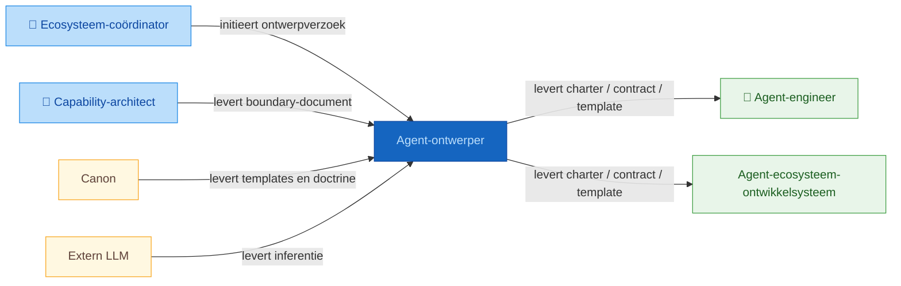
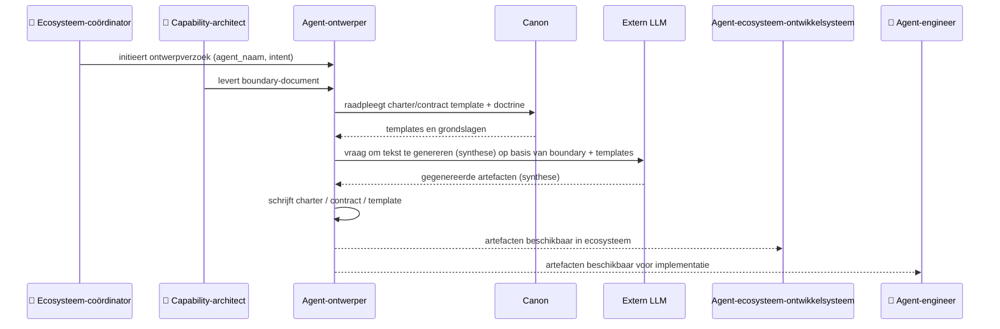

# Positionering: agent-ontwerper

## Contextdiagram

## Uitvoeringsdiagram

## Classificatie

| As | Waarde |
|----|--------|
| Vormingsfase | Vastlegging |
| Betekeniseffect | Normerend |
| Werking | Inhoudelijk |
| Bronhouding | Canon-gebonden |

## Intents en output

| Intent | Output bestand |
|--------|---------------|
| `definieer-agent-charter` | `artefacten/aeo/aeo.02.{agent_naam}/{agent_naam}.charter.md` |
| `definieer-agent-contract` | `artefacten/aeo/aeo.02.{agent_naam}/agent-contracten/{agent_naam}.{intent}.agent.md` |
| `definieer-agent-template` | `artefacten/aeo/aeo.02.{agent_naam}/templates/{template-naam}.template.md` |

## Bronbestanden

### Werkbron

- `artefacten/aeo/aeo.02.agent-ontwerper/agent-ontwerper.agent-boundary.md` — levert aanroepers, diensten en scope van de agent

### Kaderbron

- `artefacten/aeo/aeo.02.agent-ontwerper/agent-ontwerper.charter.md` — levert authoritative classificatie, kerntaken en grenzen
- `artefacten/aeo/aeo.02.agent-ontwerper/agent-contracten/agent-ontwerper.definieer-agent-charter.agent.md` — levert werkwijze en output-locatie voor intent definieer-agent-charter
- `artefacten/aeo/aeo.02.agent-ontwerper/agent-contracten/agent-ontwerper.definieer-agent-contract.agent.md` — levert werkwijze voor intent definieer-agent-contract
- `artefacten/aeo/aeo.02.agent-ontwerper/agent-contracten/agent-ontwerper.definieer-agent-template.agent.md` — levert werkwijze voor intent definieer-agent-template
