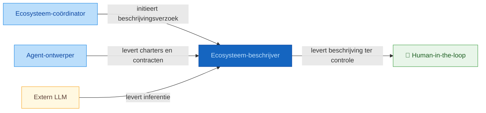
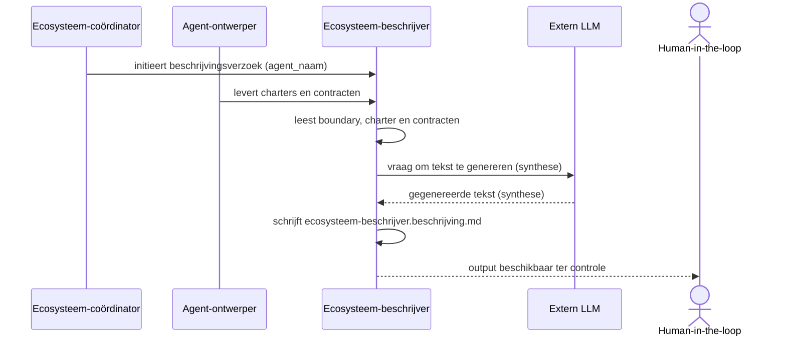

# Positionering: ecosysteem-beschrijver

## Contextdiagram

## Uitvoeringsdiagram

## Classificatie

| As | Waarde |
|----|--------|
| Vormingsfase | Verantwoording |
| Betekeniseffect | Beschrijvend |
| Werking | Inhoudelijk |
| Bronhouding | Input-gebonden |

## Intents en output

| Intent | Output bestand |
|--------|---------------|
| `beschrijf-agent-positionering` | `artefacten/aeo/aeo.02.ecosysteem-beschrijver/ecosysteem-beschrijver.beschrijving.md` |
| `beschrijf-ecosysteem-artefacten` | `artefacten/aeo/aeo.02.ecosysteem-beschrijver/ecosysteem-beschrijver.beschrijf-ecosysteem-artefacten.md` |
| `beschrijf-ecosysteem-contracten` | `artefacten/aeo/aeo.02.ecosysteem-beschrijver/ecosysteem-beschrijver.beschrijf-ecosysteem-contracten.md` |
| `beschrijf-ecosysteem-value-streams-agents` | `artefacten/aeo/aeo.02.ecosysteem-beschrijver/ecosysteem-beschrijver.beschrijf-ecosysteem-value-streams-agents.md` |

## Bronbestanden

- `artefacten/aeo/aeo.02.ecosysteem-beschrijver/ecosysteem-beschrijver.agent-boundary.md`
- `artefacten/aeo/aeo.02.ecosysteem-beschrijver/ecosysteem-beschrijver.charter.md`
- `artefacten/aeo/aeo.02.ecosysteem-beschrijver/agent-contracten/ecosysteem-beschrijver.beschrijf-agent-positionering.agent.md`
- `artefacten/aeo/aeo.02.ecosysteem-beschrijver/agent-contracten/ecosysteem-beschrijver.beschrijf-ecosysteem-artefacten.agent.md`
- `artefacten/aeo/aeo.02.ecosysteem-beschrijver/agent-contracten/ecosysteem-beschrijver.beschrijf-ecosysteem-contracten.agent.md`
- `artefacten/aeo/aeo.02.ecosysteem-beschrijver/agent-contracten/ecosysteem-beschrijver.beschrijf-ecosysteem-value-streams-agents.agent.md`
