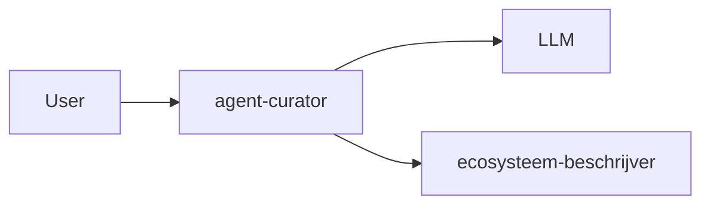

---
# IDENTIFICATIE
template-id: "009"
template-naam: beschrijf-agent-positionering

# RELATIES
artefact-type-id: "009"
agent-id: aeo.02.ecosysteem-beschrijver

# META-DATA
versie: 1.2.0
status: vers
digest: becc
---
# Template: Agent Positionering — Context Diagram

## Doel en gebruik

Dit template structureert de output van de intent `beschrijf-agent-positionering` als een bondig context diagram. Één diagram per agent; geen uitgebreide profielen of tabellen.

Gebruikt door: `beschrijf-agent-positionering`

## Structuur

```markdown
---
agent: ecosysteem-beschrijver
intent: beschrijf-agent-positionering
value_stream_fase: <value_stream_fase>
scope: <agent-naam>
timestamp: <yyyy-mm-dd HH:MM>
---

# Positionering: <agent-naam>

```mermaid
flowchart LR
    <aanroeper> --> <agent-naam>
    <agent-naam> --> <externe-dienst-of-agent>
```

## Bronbestanden

### Werkbron

- `artefacten/<vs>/<vs>.<fase>.<agent-naam>/<agent-naam>.agent-boundary.md` — levert aanroepers, diensten en scope van de agent

### Kaderbron

- `artefacten/<vs>/<vs>.<fase>.<agent-naam>/<agent-naam>.charter.md` — levert authoritative classificatie, kerntaken en grenzen
- `artefacten/<vs>/<vs>.<fase>.<agent-naam>/agent-contracten/<agent-naam>.<intent>.agent.md` — levert werkwijze en output-locatie per intent (één regel per intent)
```

## Placeholders

| Placeholder | Type | Beschrijving | Verplicht |
|-------------|------|--------------|-----------|
| `<value_stream_fase>` | string | bijv. "aeo.02" | Ja |
| `<agent-naam>` | string | kebab-case agent naam | Ja |
| `<timestamp>` | string | ISO 8601 datetime | Ja |
| `<aanroeper>` | string | wie de agent aanroept (bijv. "User", andere agent) | Ja |
| `<externe-dienst-of-agent>` | string | wat de agent aanroept (bijv. "LLM", andere agent) | Ja |

## Voorbeeld-output

> **Let op**: `<aanroeper>` is de *functionele* aanroeper — de actor die de inhoudelijke opdracht geeft. Runners, scripts en de ecosysteem-coördinator in de rol van instructie-assembler zijn infrastructuur en verschijnen NIET als aanroeper.

```markdown
---
agent: ecosysteem-beschrijver
intent: beschrijf-agent-positionering
value_stream_fase: aeo.02
scope: agent-curator
timestamp: 2026-03-21 10:00
---

# Positionering: agent-curator



## Bronbestanden

### Werkbron

- `artefacten/aeo/aeo.02.agent-curator/agent-curator.agent-boundary.md` — levert aanroepers, diensten en scope van de agent

### Kaderbron

- `artefacten/aeo/aeo.02.agent-curator/agent-curator.charter.md` — levert authoritative classificatie, kerntaken en grenzen
- `artefacten/aeo/aeo.02.agent-curator/agent-contracten/agent-curator.<intent>.agent.md` — levert werkwijze en output-locatie per intent (één regel per intent)
```

## Versiebeheer

| Versie | Datum | Wijziging |
|--------|-------|-----------|
| 1.0.0 | 2026-03-21 | Initiële template |
| 1.1.0 | 2026-03-21 | Vereenvoudigd tot context diagram |
| 1.2.0 | 2026-03-22 | Noot toegevoegd over functionele vs infrastructurele aanroeper |

---

**Template-categorie**: Agent-specifiek  
**Gebruikt door intents**: beschrijf-agent-positionering
