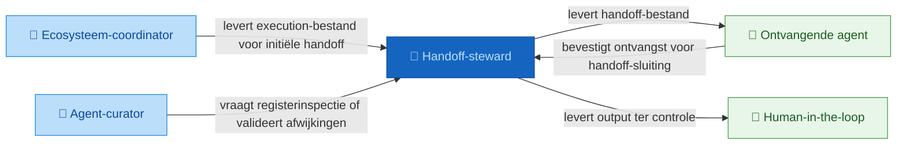
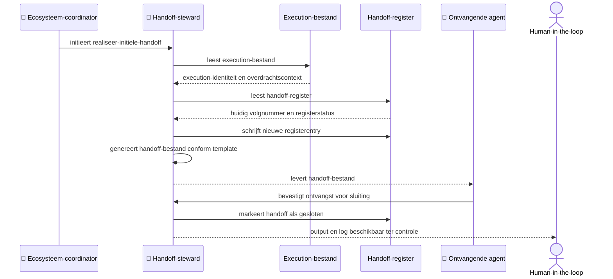

# Positionering: handoff-steward

## Contextdiagram

## Uitvoeringsdiagram

## Classificatie

| As | Waarde |
|----|--------|
| Vormingsfase | Realisatie |
| Betekeniseffect | Vastleggend |
| Werking | Inhoudelijk |
| Bronhouding | Canon-gebonden |

## Intents en output

| Intent | Output bestand |
|--------|---------------|
| `realiseer-initiele-handoff` | `handoffs/{handoff_id}.handoff.md` |
| `realiseer-handoff-sluiting` | `{handoff_register_pad}` |
| `realiseer-overzicht-inspectie-handoffs` | `{output_bestand}` (optioneel) |

## Bronbestanden

### Werkbron

- `artefacten/aeo/aeo.03.handoff-steward/handoff-steward.agent-boundary.md` — levert capability-boundary, classificatie, directe raakvlakken, inputs en outputs

### Kaderbron

- `artefacten/aeo/aeo.03.handoff-steward/handoff-steward.charter.md` — levert authoritative classificatie, kerntaken, grenzen en output-locaties
- `artefacten/aeo/aeo.03.handoff-steward/agent-contracten/handoff-steward.realiseer-initiele-handoff.agent.md` — levert input, output en werkwijze voor het aanmaken van nieuwe handoffs
- `artefacten/aeo/aeo.03.handoff-steward/agent-contracten/handoff-steward.realiseer-handoff-sluiting.agent.md` — levert input, output en werkwijze voor het sluiten van bestaande handoffs
- `artefacten/aeo/aeo.03.handoff-steward/agent-contracten/handoff-steward.realiseer-overzicht-inspectie-handoffs.agent.md` — levert input, output en werkwijze voor registerinspectie