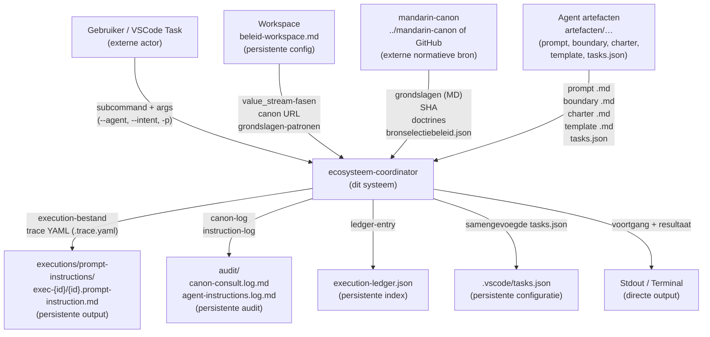
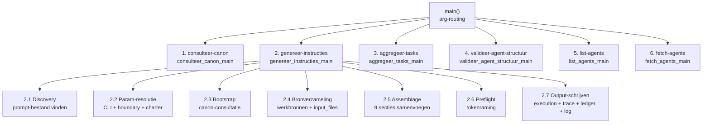
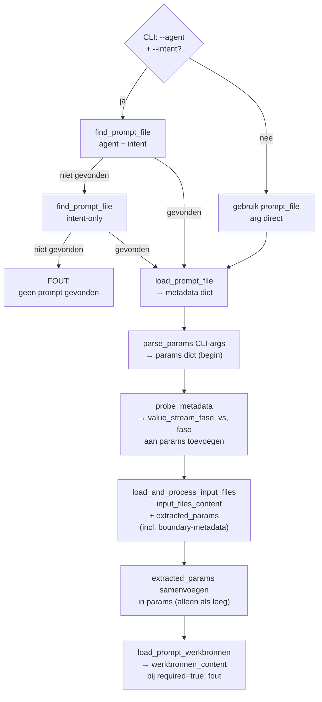
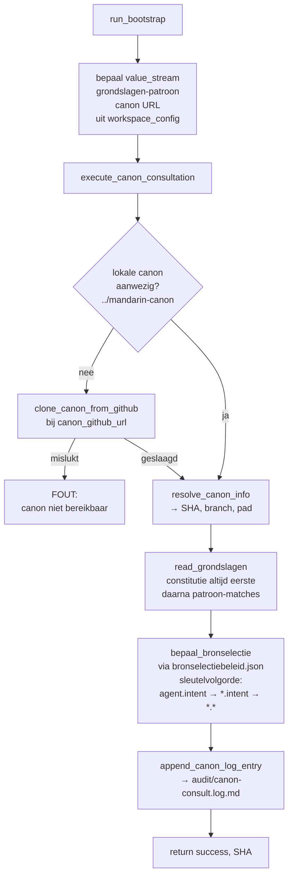
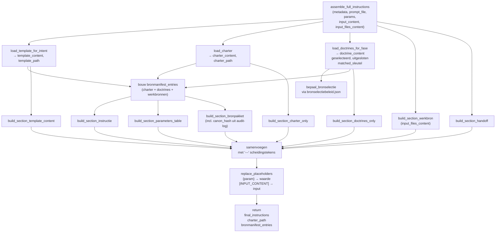
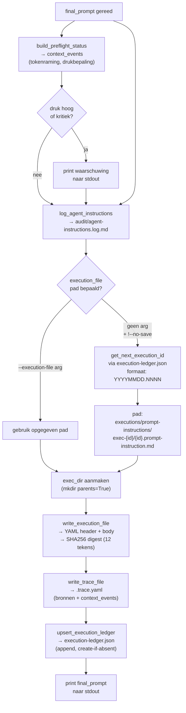

# Functionele analyse: ecosysteem-coordinator runner

## 1. Huidige toestand en pijnpunten

De runner is **3.571 regels, 80+ functies, één bestand**. Hij is organisch gegroeid en draagt zes subcommands — met als zwaarste last `genereer-instructies`. De analyse is gebaseerd op de daadwerkelijke implementatie in `artefacten/fnd/fnd.01.ecosysteem-coordinator/runner/ecosysteem-coordinator.runner.py`.

### Pijnpunten

| # | Pijnpunt | Impact |
|---|---|---|
| 1 | **Monolithisch** — geen modulaire structuur, geen submodules | Hoog: onderhoud, testbaarheid |
| 2 | **`genereer_instructies_main` is 230+ regels** en doet: discovery, param-resolutie, bootstrap, assemblage én output | Hoog: leesbaarheid, wijzigbaarheid |
| 3 | **`params` muteert globaal** — 6 plekken schrijven naar dezelfde dict in niet-transparante volgorde | Hoog: correctheid, debuggen |
| 4 | **`assemble_full_instructions` vermengt laden en bouwen** — laadt charter/template/doctrines én assembleert 9 secties | Middel: testbaarheid |
| 5 | **Twee flows, één functie** — auto-discovery en direct-mode zitten ineengevlochten in `genereer_instructies_main` | Middel: begrijpelijkheid |
| 6 | **Bronmanifest op twee plaatsen** — deels in `assemble_full_instructions`, deels in de caller | Laag: ruis |
| 7 | **`load_and_process_input_files` heeft twee verantwoordelijkheden** — file-loading en boundary-metadata-extractie | Middel |
| 8 | **Canon-consultatie is blocking** — kan niet worden overgeslagen zonder `--skip-bootstrap` | Middel |
| 9 | **Inconsistente logging** — `aggregeer-tasks` gebruikt TeeWriter, anderen niet | Laag |
| 10 | **Hardcoded sectie-scheidingstekens** (`---\n\n`) in `assemble_full_instructions` | Laag |

---

## 2. D0 — Contextdiagram

Het contextdiagram toont de systeemgrens van de ecosysteem-coordinator, alle externe actoren en de primaire datastromen.

### Externe actoren

| Actor | Rol | Richting |
|---|---|---|
| Gebruiker / VSCode Task | Initieert subcommand via CLI | → systeem |
| `beleid-workspace.md` | Bepaalt scope: fasen, canon URL, grondslagen-patronen | → systeem |
| `mandarin-canon` | Normatieve bron: constitutie, doctrines, SHA | → systeem |
| Agent artefacten | Operationele input: prompt, boundary, charter, template, tasks | → systeem |
| `executions/` | Opslag voor execution-bestanden en traces | ← systeem |
| `audit/` | Opslag voor audit-logs | ← systeem |
| `execution-ledger.json` | Append-only index van alle executions | ← systeem |
| `.vscode/tasks.json` | Geaggregeerde workspace-taken | ← systeem |

---

## 3. D1 — Decompositie hoofdprocessen

### Subcommands

| Subcommand | Primaire verantwoordelijkheid | Hoofdfunctie(s) |
|---|---|---|
| `consulteer-canon` | Git-SHA ophalen, grondslagen loggen naar audit | `consulteer_canon_main` → `execute_canon_consultation` |
| `genereer-instructies` | Execution-ready instructiebestand samenstellen | `genereer_instructies_main` + 20+ helpers |
| `aggregeer-tasks` | `tasks.json` aggregeren uit artefacten-mappen | `aggregeer_tasks_main` → `_execute_aggregeer_tasks` |
| `valideer-agent-structuur` | Mapstructuur van agent valideren tegen doctrine | `valideer_agent_structuur_main` → `_valideer_agent_folder` |
| `list-agents` | Agents per value stream fase tonen | `list_agents_main` → `discover_agents` |
| `fetch-agents` | Agent-bestanden kopiëren naar target-workspace | `fetch_agents_main` → `copy_agent_files` |

---

## 4. D2 — Uitwerkingen

### D2.1 Discovery en param-resolutie (subproces 2.1 + 2.2)

**Technische schuld hier**: `params` wordt op minstens vijf plekken gevuld in een impliciete volgorde. Latere waarden overschrijven eerdere niet altijd consistent. Er is geen centraal resolveerpunt.

---

### D2.2 Bootstrap — canon-consultatie (subproces 2.3)

---

### D2.3 Bronverzameling en assemblage (subproces 2.4 + 2.5)

**Structuur van het samengestelde bestand** (9 secties):

| # | Sectie | Inhoud |
|---|---|---|
| 0 | YAML header | execution_id, agent_id, canon-ref, bronhouding, digest |
| 1 | Instructie | Agent + intent benoemen |
| 2 | Parameters | Tabel van -p sleutels en waarden |
| 3 | Bronpakket | Manifest van alle geladen bronnen |
| 4 | Template | Het template voor de doelintent |
| 5 | Werkbron | Primaire input-bestanden (boundary, contracten) |
| 6 | Charter | Volledig charter van de doelageent |
| 7 | Doctrines | Geselecteerde canon-doctrines |
| 8 | Handoff | Instructies voor oplevering en logging |

---

### D2.4 Output-schrijven (subproces 2.6 + 2.7)

---

## 5. Algoritmische beschrijving per hoofdcomponent

### 2.1 Discovery
1. Controleer of `--agent` en `--intent` aanwezig zijn.
2. Zo ja: zoek prompt-bestand via `find_prompt_file(intent, agent)`.
3. Niet gevonden: probeer zonder agent-filter via `find_prompt_file(intent)`.
4. Niet gevonden: fout en stop.
5. Zo nee: gebruik het opgegeven `prompt_file`-pad direct.
6. Parse `--param key=value` args naar een `params`-dict.
7. Lees prompt-frontmatter; extraheer `value_stream_fase`, `vs`, `fase` indien aanwezig en voeg toe aan `params`.

### 2.2 Param-resolutie
1. Startpunt: `params` uit CLI.
2. `load_and_process_input_files`: laad bestanden uit `input_files` in prompt-metadata.
   - Als `boundary_file`: extraheer `value_stream`, `value_stream_fase`, `agent`, `bronhouding` uit frontmatter of classificatietabel.
3. Voeg `extracted_params` samen in `params`; sla bestaande waarden niet over.
4. `load_prompt_werkbronnen`: los `werkbronnen` op via lookup-strategie uit prompt-frontmatter.
   - Bij `required: true` en niet gevonden: fout en stop.
5. Resultaat: gevulde `params` en `input_files_content`.

### 2.3 Bootstrap
1. Lees `value_stream_fase` uit `params`; bepaal `value_stream`.
2. Zoek grondslagen-patroon in `workspace_config.grondslagen[value_stream]`.
3. Controleer lokale canon (`../mandarin-canon`); kloon van GitHub als afwezig.
4. Haal SHA op via `git rev-parse HEAD` in canon-directory.
5. Lees `grondslagen/constitutie.md` altijd als eerste.
6. Lees overige grondslagen via globpatroon.
7. Laad `bronselectiebeleid.json`; zoek matchend profiel: `agent.intent → *.intent → *.*`.
8. Markeer doctrines als geselecteerd of uitgesloten.
9. Schrijf canon-log-entry naar `audit/canon-consult.log.md`.
10. Geef `(success, SHA)` terug.

### 2.4 Bronverzameling
1. Zoek template-bestand voor doel-agent + intent.
2. Zoek charter-bestand voor de agent die de instructie ontvangt.
3. Laad doctrines voor de value_stream_fase (via stap 2.3-resultaat).
4. Bouw `bronmanifest_entries` voor charter, doctrines, werkbronnen.

### 2.5 Assemblage
1. Bouw 8 secties met `build_section_*`-functies (elk pure string-bouw).
2. Voeg samen met `---` als sectie-scheidingsteken.
3. Vervang `{sleutel}`-placeholders met waarden uit `params` en `input_files_content`.
4. Geef `final_instructions`, `charter_path` en `bronmanifest_entries` terug.

### 2.6 Preflight
1. Schat tokens in `final_prompt` (tiktoken indien beschikbaar, anders ~4 tekens/token).
2. Vergelijk met context-window uit `context_budget.yaml`.
3. Bij hoog (>80%) of kritiek (>95%): print standaard-waarschuwing.
4. Voeg `context_events` toe aan trace-output.

### 2.7 Output-schrijven
1. Log instructies naar `audit/agent-instructions.log.md`.
2. Bepaal execution-id: lees ledger, tel voor vandaag op, formaat `YYYYMMDD.NNNN`.
3. Maak map `executions/prompt-instructions/exec-{id}/` aan.
4. Schrijf `{id}.prompt-instruction.md` met YAML-header en body.
5. Schrijf `{id}.prompt-instruction.trace.yaml` met bronnen en context_events.
6. Voeg entry toe aan `execution-ledger.json`.

### P3 aggregeer-tasks
1. Lees `value_stream-fasen` uitsluitend uit YAML-frontmatter van `beleid-workspace.md`.
2. Glob `tasks/*.json` in alle `artefacten/{vs}/{fase}.**/` per fase.
3. Glob handmatige tasks uit `.vscode/tasks/`.
4. Parse, valideer (JSON-structuur) en dedupliceer task-entries op `id`.
5. Schrijf samengevoegd JSON naar `.vscode/tasks.json` in target-workspace.
6. Log naar `logs/aggregeer-tasks-{timestamp}.log` via TeeWriter.

---

## 6. Gefaseerd herschrijfplan

### Kernprincipe
Geen brede rewrite in één stap. Elke fase levert een runner die functioneel identiek is aan de vorige — alleen de interne structuur verbetert.

### Fase 0 — Veiligheidsbasis (nu)
- Schrijf een minimale integratietest die `genereer-instructies` end-to-end aanroept op een vaste agent + intent en verifieert dat het execution-bestand bestaat, geldige YAML-header heeft en een trace-bestand naast zich heeft.
- Dit is het regressienet voor alle latere fasen.
- Toevoegen: module-level type-hints bij functies die `params` aanraken.
- **Bestanden**: nieuw testbestand, geen wijzigingen aan runner.

### Fase 1 — Param-resolutie isoleren (laag risico)
- **Doel**: één plek, één volgorde, traceerbaar.
- Extraheer alle param-ophaallogica naar `resolve_params(cli_params, probe_metadata, extracted_params) → Dict`.
- Caller (`genereer_instructies_main`) roept deze functie aan in plaats van params op meerdere plekken te muteren.
- Geen gedragswijziging.
- **Bestanden**: alleen `genereer_instructies_main` + nieuwe helper.

### Fase 2 — Discovery splitsen (laag risico)
- **Doel**: auto-discovery en direct-mode duidelijk gescheiden.
- Extraheer: `resolve_prompt_file(agent, intent, direct_path) → Path`.
- `genereer_instructies_main` roept dit aan; daarna één gedeelde flow.
- **Bestanden**: alleen `genereer_instructies_main`.

### Fase 3 — Assemblage ontkoppelen van laden (middel risico)
- **Doel**: `assemble_full_instructions` testbaar maken zonder filesystem.
- Splits in twee functies:
  - `load_bron_pakket(metadata, params) → BronPakket` — alle IO, retourneert dataclass.
  - `build_instructions(bron_pakket, params) → str` — puur sectie-bouwen, geen IO.
- Maakt unit-testen van de assembler mogelijk.
- **Bestanden**: `assemble_full_instructions` en callers in `genereer_instructies_main`.

### Fase 4 — Output-laag isoleren (laag risico)
- **Doel**: output-gedrag wijzigen zonder assemblage te raken.
- Groepeer `write_execution_file`, `write_trace_file`, `upsert_execution_ledger` achter `write_execution_bundle(bundle: ExecutionBundle)`.
- `ExecutionBundle` is een dataclass met pad, metadata, params, final_prompt, bronmanifest, context_events.
- **Bestanden**: de drie write-functies + `genereer_instructies_main`.

### Fase 5 — Modulaire structuur (middel risico)
- **Randvoorwaarde**: integratietests uit Fase 0 zijn groen; Fase 1–4 afgerond.
- Split het bestand op in modules:
  - `canon.py` — execute_canon_consultation, read_grondslagen, bepaal_bronselectie
  - `discovery.py` — find_prompt_file, find_boundary_file, find_charter_file, resolve_params
  - `assembler.py` — load_bron_pakket, build_instructions, build_section_* functies
  - `output.py` — write_execution_bundle, log_agent_instructions
  - `tasks.py` — aggregeer-tasks volledige flow
  - `validation.py` — valideer-agent-structuur, discover_agents
- Hoofdbestand wordt CLI-router die modules importeert.

### Fase 6 — Subcommands als zelfstandige entrypoints (optioneel, later)
- `consulteer-canon`, `aggregeer-tasks` en `valideer-agent-structuur` hebben nauwelijks overlap met `genereer-instructies`.
- Kandidaten voor aparte runner of CLI-module.
- **Randvoorwaarde**: Fase 5 volledig afgerond en getest.

### Wat niet hoeft
- `list-agents` en `valideer-agent-structuur` zijn redelijk schoon; ongemoeid laten tot Fase 5.
- De 9-sectie-structuur van de execution file is functioneel correct; inhoud niet herontwerpen.
- `TeeWriter` werkt goed in `aggregeer-tasks`; niet porteer naar andere subcommands tenzij logging-uniformiteit een expliciete eis wordt.
- `fetch-agents` heeft beperkt gebruik; laag prioriteit.

---

*Gegenereerd op 2026-04-21 op basis van directe code-inspectie van `ecosysteem-coordinator.runner.py` (3.571 regels, revisie na context-budget-integratie).*
