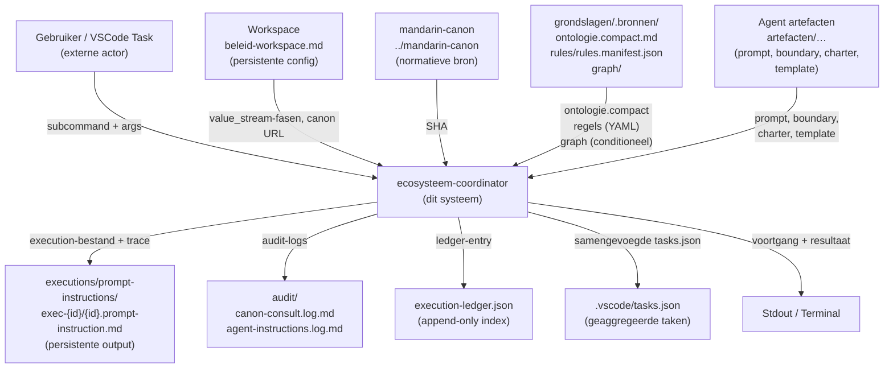
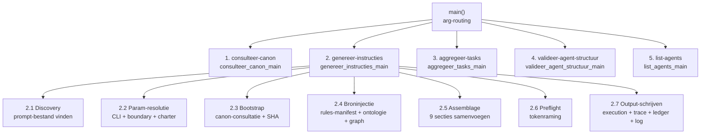
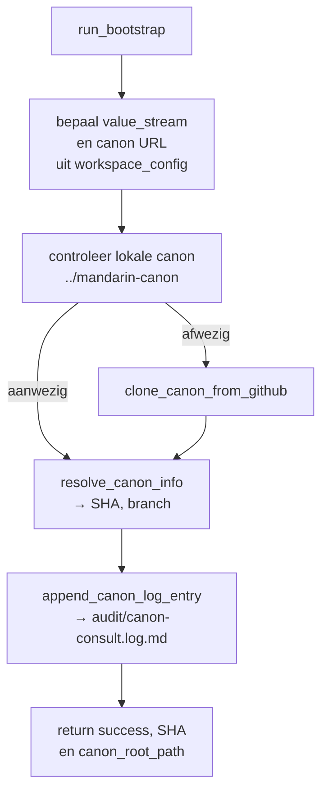
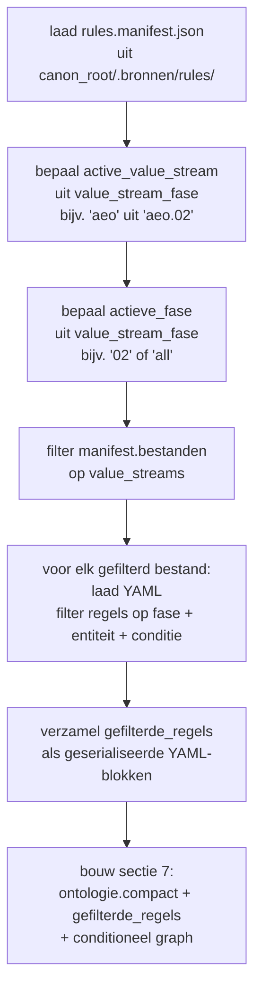

# Nieuw functioneel ontwerp: ecosysteem-coordinator runner

---

## 1. Doel en afbakening

Dit document beschrijft het **functionele doelontwerp** van de ecosysteem-coordinator runner. Het is geen beschrijving van de huidige staat, maar een expliciet gewenste toekomstige werking — aantoonbaar gegrond in de bestaande code en de canon-structuur van `mandarin-canon/grondslagen/.bronnen/`.

Het ontwerp bouwt voort op de analyse in `ecosysteem-coordinator.runner.functionele-analyse.md` (2026-04-21) en verwerkt de volgende structurele wijzigingen:

- `fetch-agents` vervalt volledig.
- Broninjectie verloopt niet langer via `bronbeleid.json` of `bronselectiebeleid.json`, maar uitsluitend via `grondslagen/.bronnen/rules/rules.manifest.json` met expliciete filtering op `value_stream_fase`.
- `sleutelset` wordt niet langer opgenomen in het gegenereerde instructie-artefact.
- `ontologie.compact.md` wordt altijd en volledig opgenomen.
- Voor `graph`-bestanden geldt een expliciet opnamebeleid (zie §7).

**Buiten scope van dit document**: runner-code, scripts, tests, configuratiebestanden en overige productiebestanden. Dit is uitsluitend een ontwerpdocument.

---

## 2. Samenvatting van de beoogde wijzigingen

| Onderdeel | Huidige situatie | Nieuwe situatie |
|---|---|---|
| `fetch-agents` | Aanwezig als subcommand | Vervalt volledig |
| Bronselectie doctrines | Via `bronselectiebeleid.json` + whitelist-profiel per intent | Via `rules.manifest.json` gefilterd op `value_stream` |
| `ontologie.compact.md` | Conditioneel (alleen bij graph-selectieprofiel) | Altijd volledig opgenomen |
| `sleutelset` | Soms opgenomen (artefacttype-matrix) | Nooit opgenomen |
| `graph`-bestanden | Conditioneel via `graph_selectieprofiel` in bronselectiebeleid | Conditioneel op basis van expliciet opnamebeleid (§7) |
| Doctrine-injectie | Volledige MD-bestanden via `load_doctrines_for_fase` | Gefilterde regels uit YAML-bestanden via manifest |
| Hoofdprocessen | 6 subcommands (incl. `fetch-agents`) | 5 subcommands |

---

## 3. Functioneel contextbeeld



### Externe actoren

| Actor | Rol | Wijziging t.o.v. huidige situatie |
|---|---|---|
| Gebruiker / VSCode Task | Initieert subcommand | Ongewijzigd |
| `beleid-workspace.md` | Scope: fasen, canon URL | Ongewijzigd |
| `mandarin-canon` | SHA-bron; `.bronnen/` als broninjectielaag | Broninjectie nu exclusief via `.bronnen/` |
| `grondslagen/.bronnen/` | Enige runner-zichtbare laag van de canon | Expliciet als afzonderlijke actor |
| Agent artefacten | Prompt, boundary, charter, template | Ongewijzigd |
| `executions/` | Output-opslag | Ongewijzigd |
| `audit/` | Audit-logs | Ongewijzigd |
| `execution-ledger.json` | Append-only index | Ongewijzigd |
| `.vscode/tasks.json` | Geaggregeerde taken | Ongewijzigd; `fetch-agents` vervalt |

---

## 4. Hoofdprocessen van de nieuwe runner



### Subcommands

| Subcommand | Verantwoordelijkheid | Status |
|---|---|---|
| `consulteer-canon` | Git-SHA ophalen, grondslagen loggen | Ongewijzigd |
| `genereer-instructies` | Execution-ready instructiebestand samenstellen | Kernwijziging: broninjectie |
| `aggregeer-tasks` | `tasks.json` aggregeren uit artefacten-mappen | Ongewijzigd |
| `valideer-agent-structuur` | Mapstructuur valideren | Ongewijzigd |
| `list-agents` | Agents per value stream tonen | Ongewijzigd |
| ~~`fetch-agents`~~ | ~~Agent-bestanden kopiëren naar consumer-workspace~~ | **Vervalt** |

---

## 5. Functioneel ontwerp van `genereer-instructies`

### 5.1 Discovery (subproces 2.1)

Ongewijzigd. Runner vindt het prompt-bestand via `--agent` + `--intent` of rechtstreeks via pad.

### 5.2 Param-resolutie (subproces 2.2)

Ongewijzigd in de huidige runner. Zie §8 voor het technische pijnpunt van globale `params`-mutatie — dit blijft bestaan in het doelontwerp totdat Fase 1 van het herschrijfplan is uitgevoerd.

De `value_stream_fase` die uit de prompt-frontmatter of boundary wordt gelezen, is de **sleutelinput voor broninjectie** in stap 2.4.

### 5.3 Bootstrap (subproces 2.3)

Vereenvoudigd in opzet. De canon-consultatie blijft: SHA ophalen en canon-log schrijven. Wat **vervalt**: het laden van `bronselectiebeleid.json` en het zoeken naar een overeenkomend intent-profiel. Bronselectie verplaatst volledig naar stap 2.4.



`canon_root_path` wordt doorgegeven aan stap 2.4.

### 5.4 Broninjectie (subproces 2.4) — primaire wijziging

Zie §6 voor volledige uitwerking.

### 5.5 Assemblage (subproces 2.5)

De negen-sectie-structuur van het execution-bestand blijft behouden, maar sectie 7 (doctrines) krijgt een andere inhoud:

| # | Sectie | Nieuwe inhoud |
|---|---|---|
| 0 | YAML header | Ongewijzigd |
| 1 | Instructie | Ongewijzigd |
| 2 | Parameters | Ongewijzigd |
| 3 | Bronpakket | Ongewijzigd; sleutelset en bronselectiebeleid verschijnen niet meer |
| 4 | Template | Ongewijzigd |
| 5 | Werkbron | Ongewijzigd |
| 6 | Charter | Ongewijzigd |
| 7 | **Kaderbronnen** | **Verandert**: regels uit YAML-bestanden (gefilterd) + volledig ontologie.compact.md + conditioneel graph |
| 8 | Handoff | Ongewijzigd |

### 5.6 Preflight en output-schrijven (2.6 + 2.7)

Ongewijzigd. De preflight-tokenraming en trace-schrijving (incl. `context_events`) blijven intact.

---

## 6. Nieuwe broninjectie en rule-filtering op `value_stream_fase`

### 6.1 Architectuurprincipe

De canon is gelaagd in drie lagen (`bronselectiebeleid.json` §laagstructuur):

| Laag | Pad | Toegankelijk voor runner |
|---|---|---|
| Laag 1 | `grondslagen/.normatief/` | Nee — mensleesbaar, normatief |
| Laag 2 | `grondslagen/.formeel/` | Nee — machine-readable ontologie (TTL) |
| **Laag 3** | `grondslagen/.bronnen/` | **Ja** — enige broninjectielaag |

De runner **mag nooit rechtstreeks uit Laag 1 of Laag 2 laden**. Alle broninjectie verloopt via Laag 3.

### 6.2 Structuur van `.bronnen/`

```
grondslagen/.bronnen/
├── ontologie.compact.md          ← altijd volledig opgenomen
├── rules/
│   ├── rules.manifest.json       ← primaire laadinstructie
│   ├── rules.bronhouding.yaml
│   ├── rules.handoff.yaml
│   ├── rules.retrieval.yaml      ← alleen value_stream: [aeo]
│   ├── rules.templategebruik.yaml
│   └── rules.traceability.yaml
├── graph/
│   ├── mandarin-model.md         ← zie §7
│   ├── mandarin-schema.cypher    ← zie §7
│   ├── mandarin-queries.cypher   ← zie §7
│   └── mandarin-seed.cypher      ← zie §7
└── sleutelset/
    └── artefacttype-matrix-per-value-stream-fase.md   ← niet opgenomen
```

### 6.3 Rule-filtering via `rules.manifest.json`

Het manifest definieert vier filterstappen:

```
Stap 1: filter bestanden op value_stream
        → laad bestand als value_streams bevat active_value_stream of 'all'

Stap 2: filter regels in geladen bestanden op fase
        → neem regel op als fase bevat actieve_fase of 'all'

Stap 3: filter regels op entiteit
        → neem regel op als entiteit bevat actieve_entiteit of 'all'

Stap 4: evalueer conditie per regel
        → sluit uit als conditie != null en evalueert op false
```

#### Implementatie in de runner



#### Concreet voorbeeld: `aeo.02`

- `active_value_stream = "aeo"`, `actieve_fase = "02"`
- Geladen bestanden: `rules.bronhouding.yaml`, `rules.handoff.yaml`, `rules.retrieval.yaml`, `rules.templategebruik.yaml`, `rules.traceability.yaml`
- `rules.retrieval.yaml` wordt geladen (value_stream: `[aeo]`) — regels met `fase: [all]` worden opgenomen

#### Concreet voorbeeld: `sfw.03`

- `active_value_stream = "sfw"`, `actieve_fase = "03"`
- Geladen bestanden: alle met `value_streams: [all]` — `rules.retrieval.yaml` (value_stream: `[aeo]`) **wordt overgeslagen**

### 6.4 Entiteit-filtering

De manifest-stap 3 filtert op `entiteit`. De runner injecteert als actieve entiteit standaard `["agent", "runner", "all"]` — zodat zowel agent-gerichte als runner-gerichte regels worden meegenomen. Dit kan via een configuratieparameter worden beperkt.

### 6.5 Vergelijking: oud vs. nieuw

| Aspect | Oud (`bronselectiebeleid.json`) | Nieuw (`rules.manifest.json`) |
|---|---|---|
| Selectie-eenheid | Intent-profiel (bijv. `genereer-instructies`) | Value stream fase |
| Granulariteit | Per-intent whitelist van doctrines | Per-value_stream set van regelbestanden |
| Inhoud injectie | Volledige doctrine-MD-teksten | Gefilterde regelblokken (YAML) |
| Fallback | `stop` | Expliciet: geen regel = geen injectie |
| Onderhoud | Één groot JSON-bestand met intent-profielen | Kleine YAML-bestanden per domein |

---

## 7. Opnamebeleid voor artefactonderdelen

### 7.1 `ontologie.compact.md` — altijd volledig

`ontologie.compact.md` definieert de canonieke terminologie van het ecosysteem. Elke agent-executie vereist begrip van deze terminologie. **Geen filtering; altijd volledig opgenomen als kaderbron.**

Reden: het document is expliciet aangeduid als "Derived LLM injection source" en bevat de taalregel die synoniemen verbiedt. Weglaten leidt tot semantische drift bij elke agent die governance-artefacten produceert.

Positie in sectie 7: als eerste blok, vóór de regels.

### 7.2 `sleutelset/artefacttype-matrix-per-value-stream-fase.md` — niet opgenomen

De artefacttype-matrix is een registrerend artefact dat het volledige ecosysteem in kaart brengt. Het bevat informatie die voor de meeste agent-executies niet direct relevant is en significant bijdraagt aan de contextdruk.

**Beslissing**: sleutelset wordt **nooit** in het gegenereerde instructie-artefact opgenomen. Als een specifieke agent de matrix nodig heeft (bijv. een validerend agent), wordt dit als expliciete `werkbron` via de prompt-frontmatter geladen.

### 7.3 `graph/` — conditioneel, op basis van value_stream en intent

De vier graph-bestanden hebben verschillende functies en zijn niet gelijkwaardig:

| Bestand | Inhoud | Opnameadvies |
|---|---|---|
| `mandarin-model.md` | Conceptueel model: mapping LDM-entiteiten → Neo4j-labels en -relaties | **Conditioneel**: opnemen wanneer de agent graph-structurering of graph-interpretatie als primaire intent heeft |
| `mandarin-schema.cypher` | DDL: CREATE CONSTRAINT en CREATE INDEX Cypher | **Conditioneel**: alleen opnemen wanneer de agent Cypher-schema aanmaakt of valideert |
| `mandarin-queries.cypher` | Voorbeeldquery's in Cypher | **Niet standaard**: alleen opnemen als de agent Cypher-retrieval uitvoert en de queries als referentie nodig heeft |
| `mandarin-seed.cypher` | Seed-data in Cypher | **Zelden**: alleen opnemen bij graph-initialisatietaken |

#### Selectiecriteria

De runner bepaalt graph-opname op basis van twee signalen:

1. **Value stream**: `rules.retrieval.yaml` heeft `value_streams: [aeo]`. Graph-bestanden zijn in de eerste plaats relevant voor `aeo`-executies.
2. **Intent-sleutelwoord**: als de intent-naam een van de volgende bevat: `graph`, `structureer`, `retrieval`, `cypher`, wordt `mandarin-model.md` standaard opgenomen.

Ontbrekend signaal → geen graph-bestanden opnemen.

#### Opnamevorm

Als graph-bestanden worden opgenomen: als afzonderlijk blok in sectie 7, ná ontologie en regels. Elk bestand wordt volledig opgenomen (niet gefilterd).

#### Motivatie uitsluiting bij standaard-executies

`mandarin-schema.cypher` en `mandarin-seed.cypher` zijn implementatie-artefacten voor Neo4j, niet conceptuele bronnen. Ze leveren geen bijdrage aan de kwaliteit van governance-artefacten (charters, boundaries, doctrines). Opname bij elke executie zou de contextdruk verhogen zonder inhoudelijke meerwaarde.

---

## 8. Beoordeling van de bestaande pijnpunten

Op basis van de tien pijnpunten uit `ecosysteem-coordinator.runner.functionele-analyse.md`:

### Volledig opgelost door dit ontwerp

| # | Pijnpunt | Oplossing |
|---|---|---|
| 6 | **Bronmanifest op twee plaatsen** — deels in `assemble_full_instructions`, deels in caller | De nieuwe broninjectie concentreert bronselectie in één stap (2.4). Het manifest wordt op één plek geladen en gefilterd. |

### Aanzienlijk verminderd

| # | Pijnpunt | Effect van nieuw ontwerp |
|---|---|---|
| 4 | **`assemble_full_instructions` vermengt laden en bouwen** | Doctrine-laden (oud: `load_doctrines_for_fase`) vervalt. De nieuwe broninjectie-stap is scherper afgebakend vóór assemblage. Het probleem vermindert maar verdwijnt niet; template en charter worden nog steeds in dezelfde functie geladen. |
| 3 | **`params` muteert globaal** | De `value_stream_fase` als broninjectie-sleutel is nu beter gedefinieerd als output van param-resolutie. Dit maakt de volgorde explicieter, ook al is de architecturele fix (Fase 1 herschrijfplan) nog niet uitgevoerd. |

### Ongewijzigd — vereisen aparte herschrijffase

| # | Pijnpunt | Reden |
|---|---|---|
| 1 | **Monolithisch** | Broninjectie-wijziging verandert geen bestandsstructuur |
| 2 | **`genereer_instructies_main` is 230+ regels** | Nieuwe stap 2.4 voegt logica toe maar verkleint de functie niet |
| 5 | **Twee flows, één functie** | Ongewijzigd |
| 7 | **`load_and_process_input_files` twee verantwoordelijkheden** | Ongewijzigd |
| 8 | **Canon-consultatie is blocking** | Bootstrap (stap 2.3) is nog steeds blocking voor de SHA; echter: `bronselectiebeleid.json`-lookup vervalt, wat de bootstrap licht vereenvoudigt |
| 9 | **Inconsistente logging** | Ongewijzigd |
| 10 | **Hardcoded sectie-scheidingstekens** | Ongewijzigd |

### Nieuwe risico's door de gewijzigde broninjectie

| Risico | Toelichting | Mitigatie |
|---|---|---|
| **Parsingfout in YAML-regelbestand** | Een kapot `.yaml`-bestand blokkeert alle executies die die value_stream gebruiken | Vang YAML-parse-fouten per bestand op; log en sla het bestand over; stop bij kritieke bestanden (bijv. `rules.bronhouding.yaml`) |
| **Regels die van toepassing zijn maar niet geladen worden** | Filtering op `value_stream` kan te krap zijn bij nieuwe waarde-stromen die geen eigen regels hebben | Zorg dat alle bestaande `rules.*.yaml` bestanden `value_streams: [all]` als fallback ondersteunen; introduceer nooit een waardestroom zonder minimale rule-dekking |
| **Contextdruk door `ontologie.compact.md`** | Altijd volledig opnemen voegt ~620 regels (~5 KB) toe aan elke executie | Accepteerbaar bij huidige modelvenster (200K tokens); bewaken via preflight |
| **Graph-inclusie zonder expliciete rule** | Als de intent-naam geen herkenbaar sleutelwoord bevat, wordt `mandarin-model.md` overgeslagen voor een executie die het wél nodig heeft | Maak graph-opname ook via prompt-frontmatter configureerbaar als werkbron-override |
| **Compatibiliteit met bestaande traces** | Bestaande `trace.yaml`-bestanden missen de nieuwe bronstructuur | Geen probleem: trace-bestanden zijn immutable na schrijven; het schema is backward-compatible |

---

## 9. Open ontwerpkeuzes en risico's

### 9.1 Granulariteit van fase-filtering

De manifest-laadinstructie filtert op `actieve_fase`. De huidige rules-bestanden gebruiken `fase: [all]` bij alle regels — fasefijnkorrel bestaat nog niet. De filterlogica is dus alvast aanwezig, maar heeft nog geen effect tot de regels worden uitgebreid met fase-specifieke entries.

**Keuze te maken**: voer de filtering nu al in de runner in (toekomstvast), of wacht tot er daadwerkelijke fase-specifieke regels bestaan (YAGNI). Aanbeveling: implementeer de filtering nu — de overhead is minimaal en de structuur staat al in het manifest.

### 9.2 Entiteit-filtering: `runner` vs. `agent`

`rules.retrieval.yaml` richt zich op entiteit `[runner]`, `rules.bronhouding.yaml` op `[agent]`. Bij injectie in een execution-bestand dat aan een *agent* wordt aangeboden, zijn runner-gerichte regels strikt gezien niet voor de agent bedoeld. Ze beschrijven wat de *runner* moet doen bij context-samenstelling.

**Keuze te maken**: filter runner-regels eruit (injecteren alleen agent-gerichte regels), of neem ze op als context voor transparantie (agent ziet hoe de runner zijn context heeft samengesteld). Aanbeveling: neem runner-regels op maar markeer ze expliciet als `-- runner-perspectief --` zodat de agent ze niet als zijn eigen gedragsverplichting interpreteert.

### 9.3 `mandarin-model.md` als standaard voor `aeo`

De aanbeveling is om `mandarin-model.md` op te nemen voor `aeo`-executies. Echter: niet elke `aeo`-executie heeft graph-begrip nodig. Een agent die een charter schrijft (bijv. `aeo.02.agent-ontwerper`) heeft minder baat bij de Neo4j-labelstructuur dan een agent die graph-query's valideert.

**Keuze te maken**: altijd voor `aeo` (eenvoudig, risico op ruis), of intent-sleutelwoord als tweede signaal (nauwkeuriger, meer onderhoud). Aanbeveling: gebruik het intent-sleutelwoord als primaire trigger; `aeo` als context-versterkend signaal maar niet als voldoende voorwaarde.

### 9.4 Migratie van `load_doctrines_for_fase`

De huidige runner bevat `load_doctrines_for_fase` die via `bepaal_bronselectie` werkt op `bronselectiebeleid.json`. In het nieuwe ontwerp vervalt deze functie. De migratie is een breaking change voor de assemblage-stap.

**Risico**: als de functie wordt verwijderd voordat de rule-filtering is geïmplementeerd, verliest de runner alle doctrine-injectie. Aanbeveling: implementeer de nieuwe broninjectie naast de bestaande logica; verwijder de oude stap pas nadat de nieuwe is geverifieerd.

---

## 10. Migratie-impact op runner en workspace

### Runner (`ecosysteem-coordinator.runner.py`)

| Component | Impact | Aard |
|---|---|---|
| `fetch_agents_main` + helpers | Verwijderd (al gedaan) | Verwijdering |
| `bepaal_bronselectie` | Vervalt — functionaliteit verplaatst naar `load_rules_for_fase` | Vervanging |
| `load_doctrines_for_fase` | Vervalt — regels-YAML vervangt doctrine-MD | Vervanging |
| `run_bootstrap` | Vereenvoudigd: geen `bronselectiebeleid.json` meer laden | Aanpassing |
| `assemble_full_instructions` | Sectie 7 krijgt andere samenstelling (regels + ontologie + graph) | Aanpassing |
| Nieuw: `load_rules_for_fase` | Laadt `rules.manifest.json`, filtert bestanden, laadt YAML, filtert regels | Toevoeging |
| Nieuw: `load_ontologie_compact` | Laadt `ontologie.compact.md` volledig | Toevoeging |
| Nieuw: `load_graph_bestanden` | Laadt conditioneel graph-bestanden op basis van intent-signalen | Toevoeging |

### Workspace-bestanden

| Bestand | Impact |
|---|---|
| `context_budget.yaml` | Ongewijzigd |
| `schemas/execution-trace-bestand.schema.json` | Ongewijzigd |
| `beleid-workspace.md` | Ongewijzigd |
| `artefacten/**/prompts/*.prompt.md` | Geen wijziging vereist; werkbronnen-sectie werkt ongewijzigd |
| `executions/` | Bestaande bestanden ongewijzigd; nieuwe executions krijgen andere sectie 7 |

### Testimplicaties

Bestaande executies blijven geldig — het schema van trace-bestanden is niet gewijzigd. Regressietests moeten worden uitgebreid met:

1. Verificatie dat `ontologie.compact.md` aanwezig is in sectie 7 van alle nieuwe executions.
2. Verificatie dat `sleutelset` niet meer voorkomt in sectie 7.
3. Verificatie dat rule-filtering correct filtert op `value_stream` (geen `aeo`-rules bij `sfw`-executie).
4. Verificatie dat `graph`-bestanden correct conditioneel worden opgenomen.

---

## Bijlage A: Broninjectiestroom — algoritmische beschrijving

**Stap 2.4 `load_bronpakket_from_bronnen(canon_root, value_stream_fase, intent_name)`**:

1. Lees `canon_root/grondslagen/.bronnen/rules/rules.manifest.json`.
2. Extraheer `active_value_stream` uit `value_stream_fase` (bijv. `"aeo"` uit `"aeo.02"`).
3. Extraheer `actieve_fase` uit `value_stream_fase` (bijv. `"02"` uit `"aeo.02"`).
4. Filter `manifest.bestanden` op `value_streams`: behoud entries waar `value_streams` bevat `active_value_stream` of `"all"`.
5. Voor elk gefilterd bestand:
   a. Laad YAML uit `canon_root/grondslagen/.bronnen/rules/{bestand}`.
   b. Filter `regels` op `fase`: behoud regels waar `fase` bevat `actieve_fase` of `"all"`.
   c. Filter `regels` op `entiteit`: behoud regels waar `entiteit` bevat `"agent"`, `"runner"` of `"all"`.
   d. Evalueer `conditie` per regel: sluit regel uit als conditie evalueert op `false`.
   e. Voeg gefilterde regels toe aan `gefilterde_regels`.
6. Laad `canon_root/grondslagen/.bronnen/ontologie.compact.md` volledig.
7. Bepaal graph-opname: als `active_value_stream == "aeo"` of `intent_name` bevat graph-sleutelwoord: laad `mandarin-model.md`.
8. Retourneer `BronPakket(ontologie=..., regels=gefilterde_regels, graph=...)`.

**Foutgedrag**:
- `rules.manifest.json` niet gevonden → fout en stop.
- Individueel YAML-bestand niet parseerbaar → log waarschuwing, sla bestand over.
- `ontologie.compact.md` niet gevonden → fout en stop.
- Graph-bestand niet gevonden terwijl verwacht → log waarschuwing, sla over.

---

*Gegenereerd op 2026-04-21 op basis van directe code-inspectie van `ecosysteem-coordinator.runner.py`, `bronselectiebeleid.json` (v2.1.0), `rules.manifest.json` (v1.0.0) en `ontologie.compact.md` (v2.0.0).*
