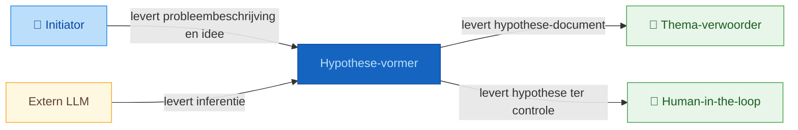
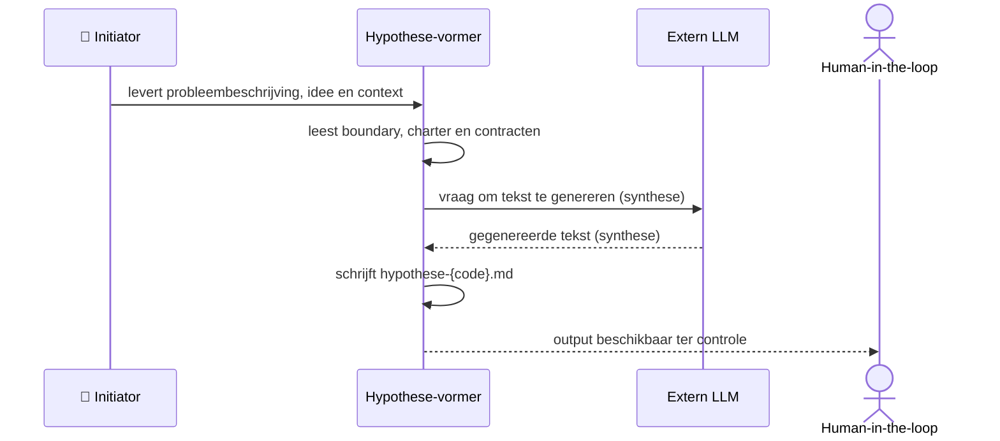

# Positionering: hypothese-vormer

## Contextdiagram

## Uitvoeringsdiagram

## Classificatie

| As | Waarde |
|----|--------|
| Vormingsfase | Verkenning |
| Betekeniseffect | Beschrijvend |
| Werking | Inhoudelijk |
| Bronhouding | Exploratief |

## Intents en output

| Intent | Output bestand |
|--------|---------------|
| `beschrijf-hypothese` | `artefacten/sfw/sfw.01.hypothese-vormer/output/hypothese-{hypothese_code}.md` |
| `beschrijf-aannames` | `artefacten/sfw/sfw.01.hypothese-vormer/output/hypothese-{hypothese_code}.md` |
| `beschrijf-toetsbaarheid` | `artefacten/sfw/sfw.01.hypothese-vormer/output/hypothese-{hypothese_code}.md` |

## Bronbestanden

### Werkbron

- `artefacten/sfw/sfw.01.hypothese-vormer/hypothese-vormer.agent-boundary.md` — levert aanroepers, diensten en scope van de agent

### Kaderbron

- `artefacten/sfw/sfw.01.hypothese-vormer/hypothese-vormer.charter.md` — levert authoritative classificatie, kerntaken en grenzen
- `artefacten/sfw/sfw.01.hypothese-vormer/agent-contracten/hypothese-vormer.beschrijf-hypothese.agent.md` — levert werkwijze en output-locatie voor intent beschrijf-hypothese
- `artefacten/sfw/sfw.01.hypothese-vormer/agent-contracten/hypothese-vormer.beschrijf-aannames.agent.md` — levert werkwijze voor intent beschrijf-aannames
- `artefacten/sfw/sfw.01.hypothese-vormer/agent-contracten/hypothese-vormer.beschrijf-toetsbaarheid.agent.md` — levert werkwijze voor intent beschrijf-toetsbaarheid
