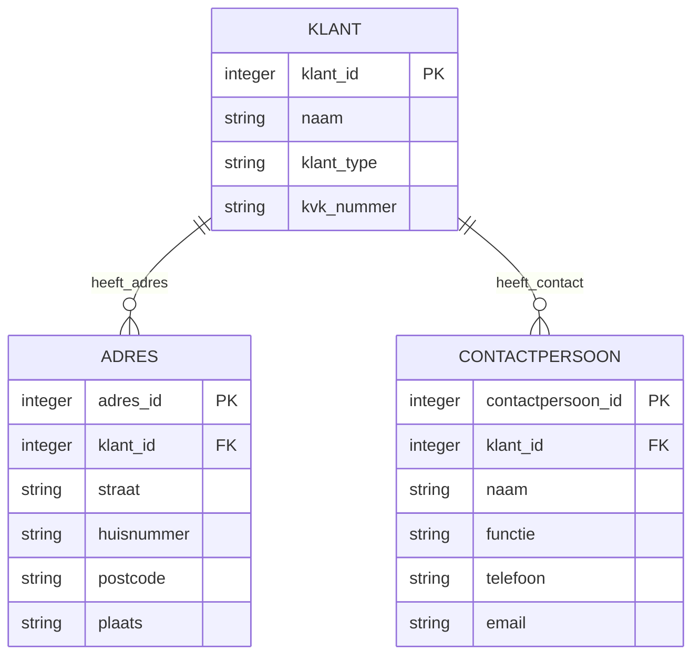

---
# IDENTIFICATIE
template-id: "022"
template-naam: logisch-model

# RELATIES
artefact-type-id: "022"
agent-id: sfw.03.logisch-modelleur

# META-DATA
versie: 1.0.0
status: vers
digest: 50f2
---

# Template: Logisch Datamodel

## Doel en gebruik

Dit template beschrijft de structuur van een **logisch datamodel** zoals geproduceerd door de intent `definieer-logisch-model`. Het model transformeert conceptuele en domeinmodellen naar logische informatiestructuren volgens de Barker-methode, met expliciete normalisatiekeuzes en traceerbaarheid naar bronconcepten.

Het template wordt gebruikt wanneer:
- Een conceptueel model naar logisch niveau moet worden getransformeerd
- Entiteiten, attributen en relaties gestructureerd vastgelegd moeten worden
- Normalisatiekeuzes expliciet en traceerbaar gedocumenteerd moeten worden

## Structuur

Dit template beschrijft de OUTPUT structuur. Het gegenereerde artefact krijgt de volgende structuur:

```markdown
---
artefact_type: logisch-datamodel
model_naam: <model-naam>
versie: <versie>
domein: <domein-naam>
bron_conceptueel_model: <pad naar bronmodel>
normalisatieniveau: <1NF|2NF|3NF|BCNF>
herkomstcode: <herkomstcode>
herkomstpositie: <initierend|voortbouwend>
gegenereerd_door: logisch-modelleur
datum: <datum>
---

# Logisch Datamodel: <Model Naam>

## Metadata

| Eigenschap | Waarde |
|------------|--------|
| Model naam | <model-naam> |
| Domein | <domein-naam> |
| Normalisatieniveau | <niveau> |
| Bron conceptueel model | <pad> |
| Datum | <datum> |

## Samenvatting

<Korte beschrijving van het model: scope, aantal entiteiten, belangrijkste structuren>

---

## Entiteiten

### <Entiteit-1>

**Beschrijving**: <wat deze entiteit representeert>

**Attributen**:

| Attribuut | Type | Verplicht | Primaire sleutel | Beschrijving |
|-----------|------|-----------|------------------|--------------|
| <attribuut-1> | <datatype> | Ja/Nee | Ja/Nee | <beschrijving> |
| <attribuut-2> | <datatype> | Ja/Nee | Nee | <beschrijving> |

**Bronverwijzing**: <referentie naar concept in bronmodel>

### <Entiteit-2>

[...structuur herhaalt per entiteit...]

---

## Relaties

| Van entiteit | Naar entiteit | Cardinaliteit | Relatie-naam | Beschrijving |
|--------------|---------------|---------------|--------------|--------------|
| <entiteit-a> | <entiteit-b> | <1:N, N:M, 1:1> | <naam> | <beschrijving> |
| <entiteit-c> | <entiteit-d> | <cardinaliteit> | <naam> | <beschrijving> |

---

## Logisch datamodel - visueel

> **Instructie**: Genereer een Mermaid erDiagram met alle entiteiten, attributen (met PK/FK markers) en relaties. Gebruik de cardinaliteitsnotatie uit de legenda.

**Vereiste structuur**:
- Elke entiteit als blok met attributen
- Primaire sleutels gemarkeerd met `PK`
- Foreign keys gemarkeerd met `FK`
- Relaties tussen entiteiten met cardinaliteit en relatienaam

**Legenda cardinaliteiten**:
- `||--||` : één-op-één (1:1)
- `||--o{` : één-op-veel (1:N)
- `}o--o{` : veel-op-veel (N:M)

**Voorbeeld syntax**:
```
erDiagram
    ENTITEIT_A ||--o{ ENTITEIT_B : "relatie_naam"
    ENTITEIT_A {
        integer id PK
        string naam
    }
    ENTITEIT_B {
        integer id PK
        integer entiteit_a_id FK
    }
```

---

## Normalisatiekeuzes

### Toegepast normalisatieniveau: <niveau>

**Motivatie**: <waarom dit niveau gekozen is>

### Beslissingen

| Beslissing | Motivatie | Bronverwijzing |
|------------|-----------|----------------|
| <beslissing-1> | <waarom deze keuze> | <concept/regel uit bron> |
| <beslissing-2> | <waarom deze keuze> | <concept/regel uit bron> |

### Afwijkingen van standaard normalisatie

| Afwijking | Reden | Impact |
|-----------|-------|--------|
| <afwijking-1> | <waarom afgeweken> | <gevolgen> |

---

## Traceerbaarheid

### Concept-naar-entiteit mapping

| Conceptueel concept | Logische entiteit | Transformatie |
|---------------------|-------------------|---------------|
| <concept-1> | <entiteit-1> | <type transformatie> |
| <concept-2> | <entiteit-2> | <type transformatie> |

### Gebruikte canonieke definities

| Term | Definitie | Bron |
|------|-----------|------|
| <term-1> | <definitie> | <bronpad> |

---

## Herkomst

- Herkomstcode: <code>
- Herkomstpositie: <initierend|voortbouwend>
- Gegenereerd door: logisch-modelleur
- Agent charter: artefacten/sfw/sfw.02.logisch-modelleur/logisch-modelleur.charter.md
- Bron conceptueel model: <pad>
- Datum: <datum>
```

## Placeholders

| Placeholder | Type | Beschrijving | Verplicht |
|-------------|------|--------------|-----------|
| `<model-naam>` | string | Unieke naam voor het logisch model | Ja |
| `<versie>` | string | Versienummer (semver formaat) | Ja |
| `<domein-naam>` | string | Naam van het domein waarbinnen het model valt | Ja |
| `<bron_conceptueel_model>` | string | Pad naar het bronmodel waaruit getransformeerd is | Ja |
| `<normalisatieniveau>` | enum | 1NF, 2NF, 3NF of BCNF | Ja |
| `<herkomstcode>` | string | JJMM.XXXX formaat, gegenereerd door runner | Ja |
| `<entiteit-naam>` | string | Naam van een entiteit (PascalCase) | Ja |
| `<attribuut>` | string | Naam van een attribuut (snake_case) | Ja |
| `<datatype>` | string | Logisch datatype (bijv. string, integer, date, boolean) | Ja |
| `<cardinaliteit>` | enum | 1:1, 1:N, N:M | Ja |
| `<beslissing>` | string | Beschrijving van een normalisatiebeslissing | Nee |
| `<datum>` | date | ISO 8601 datum | Ja |

## Validatie-criteria

Een valide output volgens dit template:
- ✓ Bevat YAML frontmatter met alle verplichte velden (artefact_type, model_naam, versie, domein, normalisatieniveau, herkomstcode)
- ✓ Bevat minimaal 1 volledig uitgewerkte entiteit met attributen
- ✓ Elke entiteit heeft minimaal 1 primaire sleutel gedefinieerd
- ✓ Relaties-sectie bevat alle relaties tussen entiteiten met cardinaliteit
- ✓ Visueel Model-sectie bevat Mermaid erDiagram met alle entiteiten en relaties
- ✓ Normalisatiekeuzes-sectie bevat motivatie voor gekozen niveau
- ✓ Traceerbaarheid-sectie koppelt elke entiteit aan bronconcepten
- ✓ Herkomst-sectie is volledig ingevuld conform doctrine-traceability.md

## Voorbeeld-output

````markdown
---
artefact_type: logisch-datamodel
model_naam: klantbeheer-logisch
versie: 1.0.0
domein: CRM
bron_conceptueel_model: modellen/conceptueel/klantbeheer-conceptueel.md
normalisatieniveau: 3NF
herkomstcode: 2604.Xk9m
herkomstpositie: initierend
gegenereerd_door: logisch-modelleur
datum: 2026-04-13
---

# Logisch Datamodel: Klantbeheer

## Metadata

| Eigenschap | Waarde |
|------------|--------|
| Model naam | klantbeheer-logisch |
| Domein | CRM |
| Normalisatieniveau | 3NF |
| Bron conceptueel model | modellen/conceptueel/klantbeheer-conceptueel.md |
| Datum | 2026-04-13 |

## Samenvatting

Dit logisch model beschrijft de klantbeheerstructuur voor het CRM-domein. Het model bevat 3 entiteiten (Klant, Adres, Contactpersoon) en is genormaliseerd tot 3NF om redundantie te elimineren.

---

## Entiteiten

### Klant

**Beschrijving**: Representeert een zakelijke of particuliere klant in het systeem.

**Attributen**:

| Attribuut | Type | Verplicht | Primaire sleutel | Beschrijving |
|-----------|------|-----------|------------------|--------------|
| klant_id | integer | Ja | Ja | Unieke identifier voor de klant |
| naam | string | Ja | Nee | Volledige naam van de klant |
| klant_type | string | Ja | Nee | Type klant: zakelijk of particulier |
| kvk_nummer | string | Nee | Nee | KvK-nummer (alleen zakelijk) |

**Bronverwijzing**: Concept "Klant" uit klantbeheer-conceptueel.md

### Adres

**Beschrijving**: Representeert een adres gekoppeld aan een klant.

**Attributen**:

| Attribuut | Type | Verplicht | Primaire sleutel | Beschrijving |
|-----------|------|-----------|------------------|--------------|
| adres_id | integer | Ja | Ja | Unieke identifier voor het adres |
| klant_id | integer | Ja | Nee | Foreign key naar Klant |
| straat | string | Ja | Nee | Straatnaam |
| huisnummer | string | Ja | Nee | Huisnummer inclusief toevoeging |
| postcode | string | Ja | Nee | Postcode |
| plaats | string | Ja | Nee | Plaatsnaam |

**Bronverwijzing**: Concept "Adresgegevens" uit klantbeheer-conceptueel.md (genormaliseerd naar aparte entiteit)

---

## Relaties

| Van entiteit | Naar entiteit | Cardinaliteit | Relatie-naam | Beschrijving |
|--------------|---------------|---------------|--------------|--------------|
| Klant | Adres | 1:N | heeft_adres | Een klant kan meerdere adressen hebben |
| Klant | Contactpersoon | 1:N | heeft_contact | Een klant kan meerdere contactpersonen hebben |

---

## Visueel Model



**Legenda cardinaliteiten**:
- `||--||` : één-op-één (1:1)
- `||--o{` : één-op-veel (1:N)
- `}o--o{` : veel-op-veel (N:M)

---

## Normalisatiekeuzes

### Toegepast normalisatieniveau: 3NF

**Motivatie**: 3NF gekozen om transitieve afhankelijkheden te elimineren en data-integriteit te maximaliseren binnen het CRM-domein.

### Beslissingen

| Beslissing | Motivatie | Bronverwijzing |
|------------|-----------|----------------|
| Adres als aparte entiteit | Elimineert herhalende groepen (1NF) en voorkomt update-anomalieën | Barker: ER-normalisatie regel 1 |
| Klant_type als attribuut, niet als subtype | Beperkt aantal klant-types (2), geen afwijkende attributen | Domeinanalyse klantbeheer |

---

## Traceerbaarheid

### Concept-naar-entiteit mapping

| Conceptueel concept | Logische entiteit | Transformatie |
|---------------------|-------------------|---------------|
| Klant | Klant | 1:1 mapping |
| Adresgegevens | Adres | Extractie uit Klant (normalisatie) |
| Contactpersoon | Contactpersoon | 1:1 mapping |

---

## Herkomst

- Herkomstcode: 2604.Xk9m
- Herkomstpositie: initierend
- Gegenereerd door: logisch-modelleur
- Agent charter: artefacten/sfw/sfw.02.logisch-modelleur/logisch-modelleur.charter.md
- Bron conceptueel model: modellen/conceptueel/klantbeheer-conceptueel.md
- Datum: 2026-04-13
````

## Gebruiksinstructies

Voor agents die dit template gebruiken:
1. Lees het bronconceptueel model volledig en identificeer alle concepten
2. Transformeer elk concept naar logische entiteiten (1:1 of split bij normalisatie)
3. Definieer attributen per entiteit met datatypes en constraints
4. Leg relaties vast met expliciete cardinaliteit
5. Genereer Mermaid erDiagram met alle entiteiten, attributen en relaties
6. Documenteer elke normalisatiekeuze met motivatie en bronverwijzing
7. Vul de traceerbaarheid-sectie in voor koppeling naar bronconcepten
8. Laat de runner de herkomstcode genereren

## Versiebeheer

| Versie | Datum | Wijziging |
|--------|-------|-----------|
| 1.0.0 | 2026-04-13 | Initieel template voor logisch-modelleur |

---

**Template-categorie**: Agent-specifiek  
**Gebruikt door intents**: definieer-logisch-model
