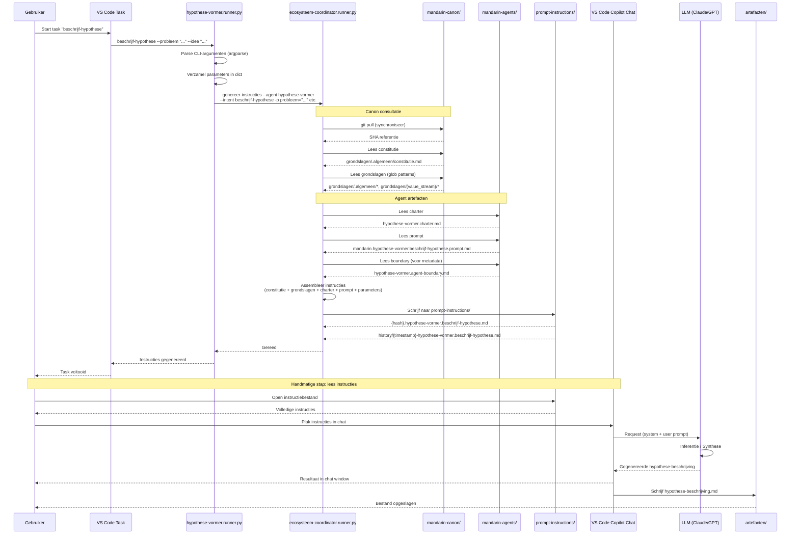

# Runner Architectuur: hypothese-vormer

## Overzicht

De `hypothese-vormer.runner.py` is een **dunne schil** (façade) die:
1. Intent-specifieke CLI-argumenten parseert
2. De generieke `ecosysteem-coordinator` aanroept voor instructie-generatie

## Architectuur

```
┌─────────────────────────────────────────────────────────────┐
│  VS Code Task (tasks.json)                                  │
│  → hypothese-vormer.runner.py beschrijf-hypothese           │
│    --probleem "..." --idee-voor-de-oplossing "..." etc.     │
└─────────────────────────┬───────────────────────────────────┘
                          │
                          ▼
┌─────────────────────────────────────────────────────────────┐
│  hypothese-vormer.runner.py                                 │
│  1. Parseert CLI-argumenten (argparse)                      │
│  2. Verzamelt parameters in dict                            │
│  3. Roept ecosysteem-coordinator aan                        │
└─────────────────────────┬───────────────────────────────────┘
                          │ 
                          ▼
┌─────────────────────────────────────────────────────────────┐
│  ecosysteem-coordinator.runner.py genereer-instructies      │
│  --agent hypothese-vormer                                   │
│  --intent beschrijf-hypothese                               │
│  -p probleem="..." -p idee_voor_de_oplossing="..." etc.     │
│                                                             │
│  → Leest charter, prompt, boundary uit mandarin-agents      │
│  → Assembleert volledige instructies                        │
│  → Schrijft naar prompt-instructions/                       │
└─────────────────────────────────────────────────────────────┘
```
## Sequence Diagram



## Verantwoordelijkheden

| Component | Verantwoordelijkheid |
|-----------|---------------------|
| **hypothese-vormer.runner.py** | Intent-specifieke CLI (`--probleem`, `--auteur` etc.), user-friendly interface |
| **ecosysteem-coordinator** | Generieke instructie-assemblage: canon (constitutie + grondslagen) + charter + prompt + parameters → instructiebestand |
| **mandarin-canon** | Centrale bron voor constitutie, doctrines en grondslagen |

## Waarom deze scheiding?

1. **User-friendly CLI**: De runner biedt named arguments (`--probleem`) i.p.v. generieke parameters (`-p probleem=...`)
2. **Herbruikbaarheid**: Alle agents gebruiken dezelfde ecosysteem-coordinator voor instructie-generatie
3. **Constitutionele basis**: Elke agent-instructie bevat de constitutie als fundament
3. **Eenvoud**: De runner hoeft geen kennis te hebben van charters, prompts of templates

## Beschikbare intents

### beschrijf-hypothese

```bash
python hypothese-vormer.runner.py beschrijf-hypothese \
  --probleem "Het probleem dat je wilt oplossen" \
  --idee-voor-de-oplossing "Je idee voor de oplossing" \
  --auteur "Naam" \
  [--bronnen "..."] \
  [--context "..."] \
  [--betrokkenen "..."]
```

### beschrijf-aannames

```bash
python hypothese-vormer.runner.py beschrijf-aannames \
  --hypothese-titel "Titel van de hypothese"
```

### beschrijf-toetsbaarheid

```bash
python hypothese-vormer.runner.py beschrijf-toetsbaarheid \
  --hypothese-statement "De hypothese statement" \
  --auteur "Naam" \
  [--hypothese-bestand "pad/naar/bestand.md"] \
  [--toetsingscontext "..."] \
  [--beschikbare-metrics "..."] \
  [--acceptatie-drempel "..."]
```

## Output

De gegenereerde instructies worden weggeschreven naar:
- `{workspace}/prompt-instructions/{hash}.{agent}.{intent}.md` (actief instructiebestand)
- `{workspace}/prompt-instructions/history/{timestamp}-{agent}.{intent}.md` (archief)

## Gerelateerde bestanden

- Charter: `../hypothese-vormer.charter.md`
- Prompts: `../prompts/mandarin.hypothese-vormer.{intent}.prompt.md`
- Boundary: `../hypothese-vormer.agent-boundary.md`
- Ecosysteem-coordinator: `../../fnd/fnd.01.ecosysteem-coordinator/runner/ecosysteem-coordinator.runner.py`
