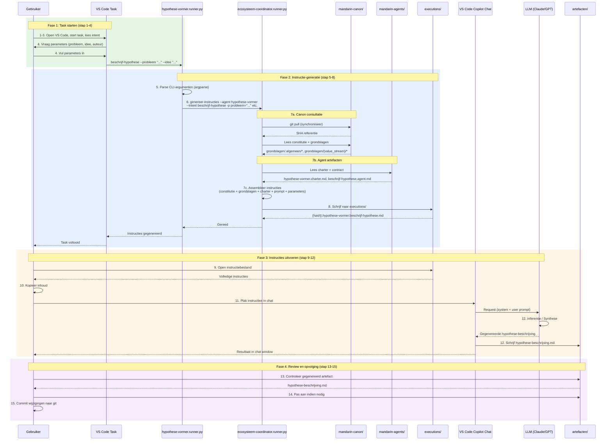

# Runner Architectuur: hypothese-vormer

## Overzicht

De `hypothese-vormer.runner.py` is een **dunne schil** (façade) die:
1. Intent-specifieke CLI-argumenten parseert
2. De generieke `ecosysteem-coordinator` aanroept voor instructie-generatie

## Architectuur

```
┌─────────────────────────────────────────────────────────────┐
│  VS Code Task (tasks.json)                                  │
│  → hypothese-vormer.runner.py beschrijf-hypothese           │
│    --probleem "..." --idee-voor-de-oplossing "..." etc.     │
└─────────────────────────┬───────────────────────────────────┘
                          │
                          ▼
┌─────────────────────────────────────────────────────────────┐
│  hypothese-vormer.runner.py                                 │
│  1. Parseert CLI-argumenten (argparse)                      │
│  2. Verzamelt parameters in dict                            │
│  3. Roept ecosysteem-coordinator aan                        │
└─────────────────────────┬───────────────────────────────────┘
                          │ 
                          ▼
┌─────────────────────────────────────────────────────────────┐
│  ecosysteem-coordinator.runner.py genereer-instructies      │
│  --agent hypothese-vormer                                   │
│  --intent beschrijf-hypothese                               │
│  -p probleem="..." -p idee_voor_de_oplossing="..." etc.     │
│                                                             │
│  → Leest charter, prompt, boundary uit mandarin-agents      │
│  → Assembleert volledige instructies                        │
│  → Schrijft naar executions/                       │
└─────────────────────────────────────────────────────────────┘
```
## Sequence Diagram



## Handleiding: Stap voor stap

### Fase 1: Task starten

1. **Open VS Code** in de project-workspace
2. **Start een task** via `Ctrl+Shift+P` → "Tasks: Run Task"
3. **Kies de gewenste agent-intent**, bijv. `sfw.01 - hypothese-vormer: beschrijf-hypothese`
4. **Vul de gevraagde parameters in** via de input-prompts (probleem, idee, auteur, etc.)

### Fase 2: Instructie-generatie (automatisch)

5. De **runner** (`hypothese-vormer.runner.py`) ontvangt de CLI-argumenten
6. De runner roept de **ecosysteem-coordinator** aan met agent-naam, intent en parameters
7. De coordinator:
   - Synchroniseert de **mandarin-canon** (git pull) en noteert de SHA-referentie
   - Leest de **constitutie** en relevante **grondslagen** uit de canon
   - Leest het **charter**, de **prompt** en de **boundary** van de agent uit mandarin-agents
   - Assembleert alles tot één instructiebestand
8. Het instructiebestand wordt weggeschreven naar `executions/`
   - Hoofdbestand: `{hash}.{agent}.{intent}.md`
   - Kopie in: `executions/history/`

### Fase 3: Instructies uitvoeren

9. **Open het gegenereerde instructiebestand** uit `executions/`
10. **Kopieer de volledige inhoud** (of selecteer en gebruik Copilot Chat)
11. **Plak in VS Code Copilot Chat** (of een andere LLM-interface)
12. De LLM leest de instructies en voert de taak uit:
    - Genereert het gevraagde artefact (hypothese, charter, contract, etc.)
    - Schrijft het resultaat naar de juiste locatie in `artefacten/`

### Fase 4: Review en opvolging

13. **Controleer het gegenereerde artefact** in de artefacten-map
14. **Pas aan indien nodig** — de LLM-output is een startpunt
15. **Commit de wijzigingen** naar git

### Samenvatting flow

```
Task starten → Runner → Coordinator → Instructiebestand → Copilot Chat → Artefact
```

| Stap | Actie | Resultaat |
|------|-------|-----------|
| 1-4 | Task selecteren en parameters invoeren | Runner wordt gestart |
| 5-8 | Instructie-assemblage | Instructiebestand in `executions/` |
| 9-12 | Instructies naar LLM sturen | Artefact gegenereerd |
| 13-15 | Review en commit | Werk opgeslagen in git |

## Verantwoordelijkheden

| Component | Verantwoordelijkheid |
|-----------|---------------------|
| **hypothese-vormer.runner.py** | Intent-specifieke CLI (`--probleem`, `--auteur` etc.), user-friendly interface |
| **ecosysteem-coordinator** | Generieke instructie-assemblage: canon (constitutie + grondslagen) + charter + prompt + parameters → instructiebestand |
| **mandarin-canon** | Centrale bron voor constitutie, doctrines en grondslagen |

## Waarom deze scheiding?

1. **User-friendly CLI**: De runner biedt named arguments (`--probleem`) i.p.v. generieke parameters (`-p probleem=...`)
2. **Herbruikbaarheid**: Alle agents gebruiken dezelfde ecosysteem-coordinator voor instructie-generatie
3. **Constitutionele basis**: Elke agent-instructie bevat de constitutie als fundament
3. **Eenvoud**: De runner hoeft geen kennis te hebben van charters, prompts of templates

## Beschikbare intents

### beschrijf-hypothese

```bash
python hypothese-vormer.runner.py beschrijf-hypothese \
  --probleem "Het probleem dat je wilt oplossen" \
  --idee-voor-de-oplossing "Je idee voor de oplossing" \
  --auteur "Naam" \
  [--bronnen "..."] \
  [--context "..."] \
  [--betrokkenen "..."]
```

### beschrijf-aannames

```bash
python hypothese-vormer.runner.py beschrijf-aannames \
  --hypothese-titel "Titel van de hypothese"
```

### beschrijf-toetsbaarheid

```bash
python hypothese-vormer.runner.py beschrijf-toetsbaarheid \
  --hypothese-statement "De hypothese statement" \
  --auteur "Naam" \
  [--hypothese-bestand "pad/naar/bestand.md"] \
  [--toetsingscontext "..."] \
  [--beschikbare-metrics "..."] \
  [--acceptatie-drempel "..."]
```

## Output

De gegenereerde instructies worden weggeschreven naar:
- `{workspace}/executions/{hash}.{agent}.{intent}.md` (actief instructiebestand)
- `{workspace}/executions/history/{timestamp}-{agent}.{intent}.md` (archief)

## Gerelateerde bestanden

- Charter: `../hypothese-vormer.charter.md`
- Prompts: `../prompts/mandarin.hypothese-vormer.{intent}.prompt.md`
- Boundary: `../hypothese-vormer.agent-boundary.md`
- Ecosysteem-coordinator: `../../fnd/fnd.01.ecosysteem-coordinator/runner/ecosysteem-coordinator.runner.py`
